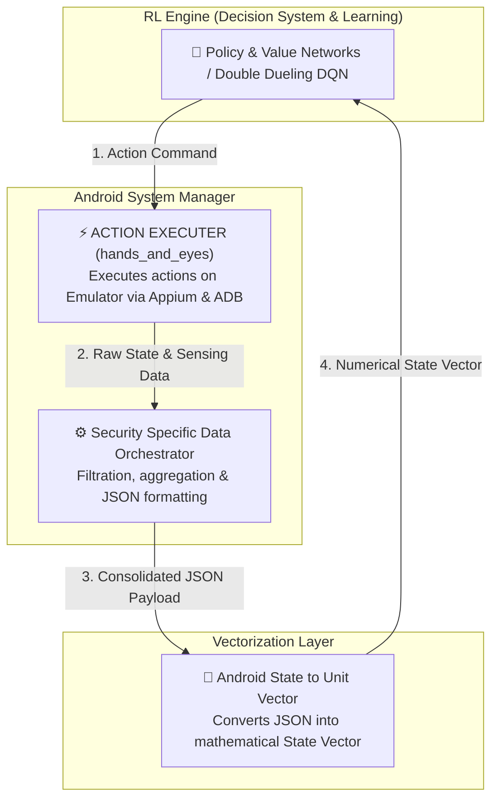

# AI Android Pentest Engine — Hands & Eyes Layer

[](https://python.org)
[](https://appium.io)
[](https://github.com/appium/appium-uiautomator2-driver)
[](https://docs.pydantic.dev)
[](https://docs.pytest.org)
[]()

> **The physical execution and dynamic observation bridge for AI-driven Android penetration testing.**

The **Hands & Eyes Layer** (`hands_and_eyes`) connects an **AI / Reinforcement Learning (RL) Agent** and an **Orchestrator** to a live Android device (physical or emulator). It converts high-level discrete actions into low-level device commands via **Appium 2.x** and **ADB**, observes the resulting state (UI element hierarchy and screenshots), and continuously scans Android system logs (`logcat`) for vulnerabilities, crashes, and exceptions.

---

## Table of Contents

- [System Architecture](#system-architecture)
- [Tools \& Technology Stack](#tools--technology-stack)
- [How It Works (Step Execution Lifecycle)](#how-it-works-step-execution-lifecycle)
- [Challenge \& Error Detection Engine](#challenge--error-detection-engine)
- [Inter-Group Communication Protocols](#inter-group-communication-protocols)
  - [1. Communication with RL Agent](#1-communication-with-rl-agent)
  - [2. Communication with Orchestrator](#2-communication-with-orchestrator)
- [Action Registry (Action IDs 0 - 19)](#action-registry-action-ids-0---19)
- [Project Directory Structure](#project-directory-structure)
- [Getting Started \& Operational Guide](#getting-started--operational-guide)
  - [Prerequisites](#prerequisites)
  - [Installation](#installation)
  - [Configuration (`.env`)](#configuration-env)
  - [Running System Health Check](#running-system-health-check)
  - [Interactive Manual Session](#interactive-manual-session)
  - [Running Automated Tests](#running-automated-tests)

---

## System Architecture



---

## Data Pipeline & Group Responsibilities

1. **Input from RL Engine**: Our layer receives the discrete action decision from the RL Decision System.
2. **Execution & Sensing (`ACTION EXECUTER`)**: We decode the action, execute it on the Android Emulator/Device using **Appium 2.x** and **ADB**, flush log buffers, and capture UI element hierarchies & screenshots.
3. **Hand-off to Data Orchestrator**: We pass raw execution state and log feedback to the **Security Specific Data Orchestrator**, which performs security info filtration and aggregates all findings into a structured **JSON**.
4. **Hand-off to Vectorization**: The Orchestrator forwards the clean JSON to the **Vectorization Layer (`Android State to Unit Vector`)**, which transforms text/UI parameters into numerical state tensors.
5. **Return to RL Engine**: The RL Engine consumes the unit vector into its Policy/Value Networks to compute rewards and decide the next step.

---

## Tools & Technology Stack

| Category | Tool / Technology | Version | Purpose |
|---|---|---|---|
| **Language** | Python | 3.10+ | Primary language for engine logic and Pydantic models. |
| **Automation Server** | Appium Server | 2.0+ | Mobile automation protocol endpoint. |
| **Automation Driver** | UiAutomator2 | 3.0+ | Direct UI interaction and accessibility tree extraction on Android. |
| **Device Bridge** | Android ADB (Platform Tools) | 34.0+ | Hardware controls, logcat buffer streaming, and app data wipes. |
| **Data Validation** | Pydantic | 2.0+ | Strict type validation for inputs (`ActionRequest`) and outputs (`ObservationPayload`). |
| **Logging** | structlog | 23.0+ | Structured, JSON-formatted application logging. |
| **XML Parsing** | lxml | 4.9+ | Fast parsing and indexing of Android UI hierarchy trees (`window_dump.xml`). |
| **Testing** | Pytest & pytest-cov | 7.4+ | Suite for unit tests and device integration tests. |

---

## How It Works (Step Execution Lifecycle)

```
       [RL Agent]
           │
           │  1. Issues ActionRequest(action_id, parameters)
           ▼
   [PentestEngine.step()]
           │
           ├─► 2. Clears device logcat buffer
           ├─► 3. Decodes & executes action via Appium / ADB
           ├─► 4. Waits for UI settle time (ACTION_SETTLE_TIME_MS)
           ├─► 5. Collects new UI state & screenshot
           ├─► 6. Extracts & classifies logcat anomalies
           │
           ▼  7. Returns ObservationPayload JSON
       [RL Agent]
```

1. **Request Intake**: The engine receives a strongly-typed `ActionRequest` containing an integer `action_id` (0 to 19) and optional parameters (e.g., `element_index`, `text_input`).
2. **Buffer Flush**: Prior to action execution, `LogcatMonitor` flushes old logcat entries to isolate logs generated strictly by this step.
3. **Execution ("Hands")**: `ActionDecoder` maps the `action_id` to either Appium UI operations (e.g., tap element at index) or ADB shell commands (e.g., toggle Wi-Fi, force-stop app).
4. **Settling**: The engine pauses for configurable `ACTION_SETTLE_TIME_MS` to allow UI animations and webviews to settle.
5. **Observation ("Eyes")**: `StateCollector` extracts the accessibility XML tree, parses interactive elements (`clickable`, `scrollable`, `focusable`), computes element centers, and captures a PNG screenshot (base64).
6. **Anomaly Sensing**: `LogcatMonitor` scans the recent logcat buffer for fatal exceptions, app crashes, ANRs (Application Not Responding), and security leaks.
7. **Payload Assembly**: The engine combines UI state, screenshots, device state, step status, and detected anomalies into a validated `ObservationPayload` JSON response.

---

## Challenge & Error Detection Engine

The engine features built-in challenge and error detection to classify issues occurring on the target device:

### 1. Logcat Anomaly Detection (`LogcatMonitor`)

The logcat scanner evaluates system logs against regex rules to catch vulnerabilities and crashes:

| Anomaly Type | Triggers & Identifiers | Default Severity | Description |
|---|---|---|---|
| `ANR` | `Application Not Responding`, `ANR in <pkg>` | `CRITICAL` | App UI thread blocked for > 5 seconds. |
| `APP_CRASH` | `FATAL EXCEPTION`, `Process <pkg> died` | `CRITICAL` | App crashed with unhandled fatal exception. |
| `UNCAUGHT_EXCEPTION` | `java.lang.NullPointerException`, `java.lang.SecurityException` | `HIGH` | Exception stack trace detected in logcat. |
| `SECURITY_LEAK` | Sensitive data tags (`password`, `token`, `secret`, `api_key`) | `MEDIUM` | Sensitive data leaked in cleartext logcat output. |

### 2. Status Classification (`StepStatus`)

Every step returns one of five top-level status codes:

- **`SUCCESS`**: Action executed successfully and state was captured.
- **`ACTION_FAILED`**: Requested UI element was not found, index out of bounds, or element not clickable.
- **`APP_CRASHED`**: App crashed or encountered an ANR during or immediately after the action.
- **`SESSION_ERROR`**: Appium driver connection dropped or driver became unresponsive (triggers auto-recovery).
- **`DEVICE_ERROR`**: ADB lost connection with the physical device or emulator.

---

## Inter-Group Communication Protocols

### 1. Communication with RL Agent

The RL Agent interacts with `hands_and_eyes` by issuing an **`ActionRequest`** JSON payload and receiving an **`ObservationPayload`** JSON response.

#### Action Request Schema (`ActionRequest`)

```json
{
  "action_id": 1,
  "parameters": {
    "element_index": 3,
    "text_input": null,
    "duration_ms": null
  },
  "metadata": {
    "episode_id": "ep_20260727_001",
    "step_number": 4
  }
}
```

#### Observation Payload Schema (`ObservationPayload`)

```json
{
  "status": "SUCCESS",
  "step_number": 4,
  "action_executed": {
    "action_id": 1,
    "name": "TAP",
    "target_index": 3
  },
  "ui_state": {
    "current_package": "com.target.vulnerableapp",
    "current_activity": ".LoginActivity",
    "element_count": 12,
    "xml_hash": "e3b0c44298fc1c149afbf4c8996fb92427ae41e4649b934ca495991b7852b855",
    "interactive_elements": [
      {
        "index": 0,
        "class": "android.widget.EditText",
        "text": "Username",
        "resource_id": "com.target.vulnerableapp:id/username",
        "bounds": {"left": 100, "top": 400, "right": 980, "bottom": 520},
        "center": {"x": 540, "y": 460},
        "clickable": true,
        "enabled": true
      }
    ]
  },
  "anomalies": [
    {
      "anomaly_type": "SECURITY_LEAK",
      "severity": "MEDIUM",
      "tag": "AuthManager",
      "message": "Token emitted in logcat: eyJhbGciOiJIUzI1Ni...",
      "timestamp": "2026-07-27T10:42:00Z"
    }
  ],
  "screenshot_base64": "iVBORw0KGgoAAAANSUhEUgAA...",
  "device_state": {
    "battery_level": 100,
    "wifi_enabled": true,
    "airplane_mode": false,
    "is_screen_on": true
  },
  "step_duration_ms": 650.5
}
```

---

### 2. Communication with Orchestrator

The Orchestrator manages session lifecycles, global configurations, and episode boundaries.

#### Environment Variables (`.env`)

```dotenv
DEVICE_SERIAL=emulator-5554
APPIUM_URL=http://localhost:4723
TARGET_PACKAGE=com.target.vulnerableapp
TARGET_ACTIVITY=.MainActivity
LOGCAT_BUFFER_SIZE=5000
ACTION_SETTLE_TIME_MS=500
MAX_INTERACTIVE_ELEMENTS=64
SCREENSHOT_QUALITY=80
```

#### Orchestrator Lifecycle Methods

```python
from hands_and_eyes import PentestEngine
from hands_and_eyes.config import EngineConfig

# 1. Instantiate engine with environment configuration
config = EngineConfig()
engine = PentestEngine(config=config)

# 2. Start sessions (Appium driver, ADB bridge, Logcat monitor)
engine.initialize()

# 3. Execute actions during an episode
observation = engine.step(action_request)

# 4. Reset target application state between episodes
engine.reset_app()

# 5. Safely shutdown sessions
engine.shutdown()
```

---

## Action Registry (Action IDs 0 - 19)

| ID | Action Name | Parameter Required | Description |
|---|---|---|---|
| `0` | **`NOP`** | None | No operation. Captures current UI state and logcat without executing action. |
| `1` | **`TAP`** | `element_index` | Taps element at target index in interactive element list. |
| `2` | **`LONG_PRESS`** | `element_index`, `duration_ms` | Long presses element for specified duration (default 1500ms). |
| `3` | **`SWIPE_UP`** | None | Swipes up from screen bottom to top (scrolls content down). |
| `4` | **`SWIPE_DOWN`** | None | Swipes down from screen top to bottom (scrolls content up). |
| `5` | **`SWIPE_LEFT`** | None | Swipes from right edge to left edge. |
| `6` | **`SWIPE_RIGHT`** | None | Swipes from left edge to right edge. |
| `7` | **`PRESS_BACK`** | None | Triggers hardware/system Back button press via ADB. |
| `8` | **`PRESS_HOME`** | None | Triggers hardware/system Home button press via ADB. |
| `9` | **`PRESS_RECENTS`** | None | Triggers Recents / App Switcher overview press. |
| `10` | **`TYPE_TEXT`** | `text_input` | Types text into currently focused input field. |
| `11` | **`CLEAR_FIELD`** | `element_index` | Clears text from input field at element index. |
| `12` | **`TOGGLE_WIFI`** | None | Toggles Wi-Fi state via ADB command. |
| `13` | **`TOGGLE_AIRPLANE`** | None | Toggles Airplane Mode state via ADB command. |
| `14` | **`FORCE_STOP_APP`** | None | Force kills the target package via `adb shell am force-stop`. |
| `15` | **`CLEAR_APP_DATA`** | None | Wipes target package app data and cache via `adb shell pm clear`. |
| `16` | **`LAUNCH_APP`** | None | Starts target main activity via `adb shell am start`. |
| `17` | **`TAKE_SCREENSHOT`** | None | Explicitly takes screen capture without performing UI action. |
| `18` | **`ROTATE_SCREEN`** | None | Toggles device display orientation (portrait / landscape). |
| `19` | **`OPEN_NOTIFICATIONS`**| None | Pulls down system notification shade. |

---

## Project Directory Structure

```
AI_Android_Pentest_Engine/
├── agent.md                        # Master architectural directive
├── pyproject.toml                  # Package dependencies & tool configs
├── requirements.txt                # Fixed requirements list
├── README.md                       # Repository guide & documentation
├── .env.example                    # Template environment variables
├── src/
│   └── hands_and_eyes/             # Core production package
│       ├── __init__.py             # Exports PentestEngine
│       ├── config.py               # Pydantic EngineConfig loader
│       ├── engine.py               # Top-level PentestEngine orchestrator
│       ├── adb/
│       │   ├── bridge.py           # Subprocess wrapper for adb shell
│       │   └── device.py           # Device state query helper
│       ├── core/
│       │   ├── action_decoder.py   # Maps action_id -> Appium/ADB commands
│       │   ├── appium_executor.py  # Appium session & UI driver controller
│       │   ├── logcat_monitor.py   # Anomaly engine & logcat regex scanner
│       │   └── state_collector.py  # XML view tree parser & element bounds
│       └── models/
│           ├── actions.py          # ActionRequest, ActionID, ActionParameters
│           └── observations.py     # ObservationPayload, UIState, AnomalyEvent
├── scripts/
│   ├── healthcheck.py              # Environment diagnostic tool
│   └── run_manual_session.py       # Interactive CLI test session runner
└── tests/                          # Test suite
    ├── test_action_decoder.py
    ├── test_appium_executor.py
    ├── test_engine_integration.py
    ├── test_logcat_monitor.py
    └── test_state_collector.py
```

---

## Getting Started & Operational Guide

### Prerequisites

- **Python 3.10+** installed.
- **Node.js & Appium 2.x**:
  ```bash
  npm install -g appium
  appium driver install uiautomator2
  ```
- **Android SDK Platform Tools** (`adb` available in PATH).
- **Android Emulator or Hardware Device** (Developer Options & USB Debugging enabled).

### Installation

Clone the repository and install dependencies in editable mode:

```bash
# Clone the repository
git clone https://github.com/derso521/Security-testing-tool-dev.git
cd Security-testing-tool-dev

# Create virtual environment
python -m venv .venv
.venv\Scripts\activate      # Windows PowerShell
# source .venv/bin/activate  # Linux/macOS

# Install package with dev dependencies
pip install -e ".[dev]"
```

### Configuration (`.env`)

Copy `.env.example` to `.env` and adjust your target device parameters:

```bash
copy .env.example .env
```

### Running System Health Check

Before starting an AI testing run, verify your environment setup:

```bash
python scripts/healthcheck.py
```

*Validates Appium server connection, ADB device status, target package installation, and permissions.*

### Interactive Manual Session

Test actions manually via interactive CLI prompt:

```bash
python scripts/run_manual_session.py
```

Enter integer `action_id` numbers (e.g. `16` to launch app, `1` to tap element index `0`) to test engine step outputs.

### Running Automated Tests

Execute the unit test suite:

```bash
# Run unit tests
pytest -m unit -v

# Run full integration test suite (requires active emulator and Appium server)
pytest -m integration -v

# Run test coverage report
pytest --cov=hands_and_eyes --cov-report=term-missing
```
