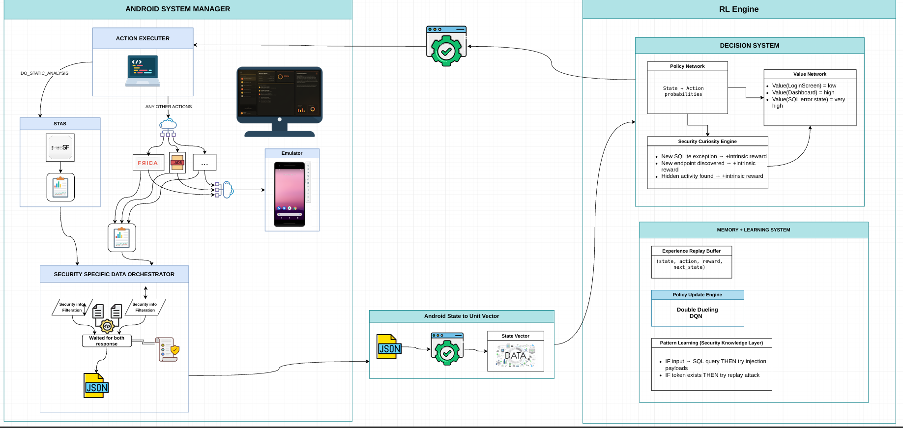

# AI-Powered Android Security Testing Tool

> Intelligent Android application security analysis using Static Application
> Security Testing (SAST), Dynamic Application Security Testing (DAST), and
> Reinforcement Learning (Double Dueling DQN).

## Table of Contents

- Overview
- High-Level Architecture
- Key Design Principles
- Reinforcement Learning Workflow
- Development Teams
- Technology Stack
- Project Roadmap
- Current Status
- Contributing
- License

---

## Overview

The AI-Powered Android Security Analysis System is an intelligent Android
application security platform that combines Static Application Security
Testing (SAST), Dynamic Application Security Testing (DAST), and
Reinforcement Learning (RL) to automate Android penetration testing.

Unlike traditional scanners that execute a fixed sequence of tests, the RL
agent learns which security action to perform next based on the
application's current security state, maximizing vulnerability discovery
while minimizing unnecessary actions.

---

## High-Level Architecture



The system consists of three major components, each owned by a development
team.

### 1. Android System Manager

Handles emulator management, action execution, and all static/dynamic tool
integration.

**Sub-components**

- **Action Executor** — dispatches security actions (`DO_STATIC_ANALYSIS`, or
  any other action) to the appropriate tool.
- **STAS** — static analysis component, wraps MobSF and produces a static
  findings report.
- **Frida / ADB / other dynamic tools** — executed against the Android
  Emulator to perform dynamic analysis (hooking, command execution, log
  capture).
- **Security Specific Data Orchestrator** — collects and filters results
  from both static and dynamic tool paths ("Security Info Filtration"),
  waits for both responses, and emits a single consolidated security JSON.

### 2. Android State to Unit Vector

Converts the filtered security JSON produced by the Security Specific Data
Orchestrator into a normalized numerical state vector.

**Responsibilities**

- JSON processing
- Feature extraction
- Data encoding
- Feature normalization
- State vector generation

### 3. RL Engine

Learns the optimal sequence of security actions using Double Dueling DQN.

**Decision System**

- **Policy Network** — maps state to action probabilities.
- **Value Network** — estimates the value of each state (e.g. value of
  reaching a login screen vs. a dashboard vs. a SQL error state).
- **Security Curiosity Engine** — provides intrinsic reward for novel
  security-relevant events (new exceptions, newly discovered endpoints,
  hidden activities).

**Memory + Learning System**

- **Experience Replay Buffer** — stores `(state, action, reward, next_state)`
  transitions.
- **Policy Update Engine** — updates the Double Dueling DQN using sampled
  experience.
- **Pattern Learning (Security Knowledge Layer)** — encodes learned
  heuristics (e.g. "IF input → SQL query THEN try injection payloads").

The selected action loops back to the Android System Manager, closing the
feedback loop.

---

## Key Design Principles

- **LLM efficiency is a hard architectural constraint, not an optimization.**
  The LLM Reasoner is called exactly once per testing session, at the end, on
  a pre-filtered findings log. It is never invoked inside the RL exploration
  loop. This keeps the loop fast and keeps LLM cost/latency off the critical
  path of test execution.
- **MVP-first.** The current build intentionally strips out orchestration
  abstraction layers, external threat intel feeds, multi-axis reward
  shaping, and always-on LLM calls. These are deferred until the core
  RL + static/dynamic pipeline is validated.
- **Rule-based reward for MVP.** Reward shaping is simplified for the first
  working version; richer, multi-axis reward design is a post-MVP goal.

---

## Reinforcement Learning Workflow

```text
Android APK
      │
      ▼
Android System Manager
      │
      ▼
Security Information Filtering (Security Specific Data Orchestrator)
      │
      ▼
Security JSON
      │
      ▼
Android State to Unit Vector
      │
      ▼
State Vector
      │
      ▼
RL Engine (Double Dueling DQN)
      │
      ▼
Select Best Action
      │
      ▼
Android System Manager
      └────────── Feedback Loop ─────────►
```

---

## Development Teams

| Team                              | Responsibilities                                                                                                               |
| --------------------------------- | ------------------------------------------------------------------------------------------------------------------------------ |
| **Android System Manager**        | Emulator management, Action Executor, SAST/DAST tool integration, Frida, ADB, Security Specific Data Orchestrator              |
| **Android State to Unit Vector**  | JSON processing, feature extraction, encoding, normalization, state vector generation                                          |
| **Reinforcement Learning Engine** | RL environment, reward function, Double Dueling DQN, Experience Replay Buffer, training, evaluation, Security Curiosity Engine |

### Reporting & Intelligence

A LLM-based reporting module (the LLM Reasoner) is planned to
generate human-readable security reports, vulnerability explanations, risk
assessments, and remediation recommendations from the RL Engine's filtered
findings. Since it consumes the RL Engine's outputs, the **Reinforcement
Learning Engine team** owns its integration.

---

## Technology Stack

- **Languages:** Python, JavaScript/TypeScript, Java
- **RL:** PyTorch, Gymnasium, Stable-Baselines3, Double Dueling DQN
- **Android:** Android SDK, Emulator, ADB, Frida
- **Static Analysis:** MobSF
- **Data:** JSON, NumPy, Pandas

---

## Project Roadmap

- **Phase 1:** Android execution environment & security tool integration
- **Phase 2:** JSON → State Vector pipeline
- **Phase 3:** RL environment, reward design, Double Dueling DQN training
- **Phase 4:** Model evaluation & optimization
- **Phase 5:** LLM-powered reporting & deployment

---

## Current Status

- High-level architecture completed
- Team responsibilities defined
- Android System Manager in development
- Android State to Unit Vector in development
- Reinforcement Learning Engine in development
- LLM reporting module planned

---

## Contributing

Project members should create feature branches, follow coding standards,
and submit Pull Requests for review.

---

## License

License information will be added as the project matures.
